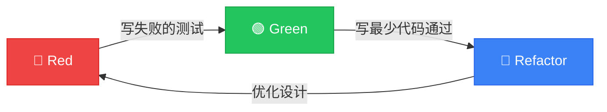

# 今天的内容 (60min)

<v-click>

### 📚 理论 (15min)
- 什么是 TDD
- 红-绿-重构循环
- TDD 的价值

</v-click>

<v-click>

### 💻 手动 TDD 实战 (15min)
- 创建营销活动
- 一步步演示 TDD 流程

</v-click>

<v-click>

### 🤖 AI + TDD 实战 (20min)
- AI 时代的 TDD
- Cursor 实战演示

</v-click>

<v-click>

### 🎯 总结 (10min)
- 最佳实践
- Q&A

</v-click>

---
layout: image-right
image: https://images.unsplash.com/photo-1516116216624-53e697fedbea?w=800
---

# 什么是 TDD？

<v-clicks>

**Test-Driven Development / Design**

> 是一项 **开发活动**，而不是测试活动

测试是 **手段**，设计是 **目标**

</v-clicks>

<v-click>

> "编写单元测试更像一种设计行为、文档行为，而不是验证行为"
>
> — Robert C. Martin

</v-click>

---
layout: center
---

# 🔄 红-绿-重构循环

<v-clicks>

  

    
Red

    
写一个失败的测试

  

  

    
Green

    
最少代码通过

  

  

    
Refactor

    
优化设计

  

</v-clicks>

---
layout: center
class: text-center
---

# TDD 的价值

<v-click>

  
📋

  
Specification

  
测试即需求规格

</v-click>

<v-click>

  
📖

  
Documentation

  
测试即活文档

</v-click>

<v-click>

  
🛡️

  
Safety Net

  
测试即安全网

</v-click>

