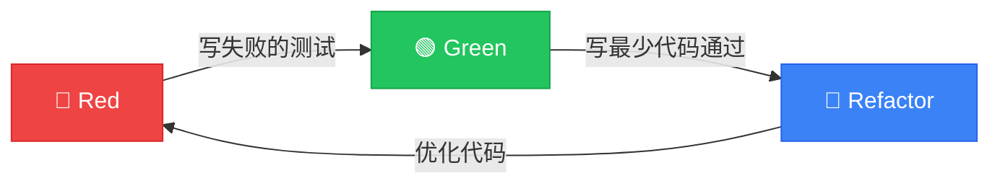

# 🧪 TDD 实战训练营

### 测试驱动开发的艺术与实践

<div class="pt-12">
  <span @click="$slidev.nav.next" class="px-2 py-1 rounded cursor-pointer" hover="bg-white bg-opacity-10">
    按空格键开始你的 TDD 之旅 <carbon:arrow-right class="inline"/>
  </span>
</div>

<div class="abs-br m-6 flex gap-2">
  <span class="text-sm opacity-50">Java · Spring Boot · MyBatis Plus</span>
</div>

---
transition: fade-out
---

# 今天我们将一起

<v-clicks>

## 🎯 体验 TDD 的魔力

## 🔄 掌握红-绿-重构循环

## 💻 实战：用户管理系统

## 🚀 感受代码质量的飞跃

</v-clicks>

<style>
h2 {
  background: linear-gradient(120deg, #bd34fe 30%, #41d1ff);
  background-clip: text;
  -webkit-background-clip: text;
  -webkit-text-fill-color: transparent;
  font-size: 2rem !important;
  margin: 1.5rem 0 !important;
}
</style>

---
layout: image-right
image: https://images.unsplash.com/photo-1516116216624-53e697fedbea?w=800
---

# 什么是 TDD？

<v-clicks>

**Test-Driven Development**

> 先写测试，再写代码

不是测试技术，而是 **设计方法论**

</v-clicks>

<v-click>

<div class="mt-8 p-4 bg-gradient-to-r from-purple-500/20 to-blue-500/20 rounded-lg">

### 核心思想
写代码之前，先思考：
- 这段代码要做什么？
- 怎么验证它是对的？

</div>

</v-click>

---
layout: center
class: text-center
---

# TDD 的三条法则

<div class="grid grid-cols-3 gap-8 mt-12">

<v-click>
<div class="p-6 bg-red-500/20 rounded-2xl border border-red-500/50">
  <div class="text-6xl mb-4">1️⃣</div>
  <div class="text-lg font-bold text-red-400">在写失败的测试之前</div>
  <div class="text-sm mt-2 opacity-80">不写任何生产代码</div>
</div>
</v-click>

<v-click>
<div class="p-6 bg-green-500/20 rounded-2xl border border-green-500/50">
  <div class="text-6xl mb-4">2️⃣</div>
  <div class="text-lg font-bold text-green-400">只写刚好让测试失败的代码</div>
  <div class="text-sm mt-2 opacity-80">编译失败也算失败</div>
</div>
</v-click>

<v-click>
<div class="p-6 bg-blue-500/20 rounded-2xl border border-blue-500/50">
  <div class="text-6xl mb-4">3️⃣</div>
  <div class="text-lg font-bold text-blue-400">只写刚好通过测试的代码</div>
  <div class="text-sm mt-2 opacity-80">不多不少，恰到好处</div>
</div>
</v-click>

</div>

---
layout: center
---

# 🔄 红-绿-重构循环

<div class="flex items-center justify-center mt-8">



</div>

<v-clicks>

<div class="grid grid-cols-3 gap-4 mt-12 text-center">
  <div class="text-red-400">
    <div class="text-2xl font-bold">Red</div>
    <div class="text-sm">写一个失败的测试</div>
  </div>
  <div class="text-green-400">
    <div class="text-2xl font-bold">Green</div>
    <div class="text-sm">用最简单的方式通过</div>
  </div>
  <div class="text-blue-400">
    <div class="text-2xl font-bold">Refactor</div>
    <div class="text-sm">在测试保护下重构</div>
  </div>
</div>

</v-clicks>

---
layout: two-cols
---

# 传统开发 vs TDD

<template v-slot:default>

## 😰 传统方式

<v-clicks>

1. 写一堆代码
2. 手动测试
3. 发现 Bug
4. 改代码
5. 再测试
6. 又有 Bug...
7. 😭 无限循环

</v-clicks>

</template>

<template v-slot:right>

## 😎 TDD 方式

<v-clicks>

1. 写测试（失败）
2. 写代码（通过）
3. 重构（优化）
4. ✅ 循环往复
5. 🎉 代码质量高
6. 💪 重构有信心
7. 📝 测试即文档

</v-clicks>

</template>

---
class: px-20
---

# 🛠️ 技术栈准备

<div class="grid grid-cols-2 gap-8 mt-8">

<v-click>
<div class="p-6 rounded-xl bg-gradient-to-br from-green-500/20 to-green-600/10 border border-green-500/30">

### Java 21 + Spring Boot 3.2

```xml
<parent>
    <groupId>org.springframework.boot</groupId>
    <artifactId>spring-boot-starter-parent</artifactId>
    <version>3.2.0</version>
</parent>
```

</div>
</v-click>

<v-click>
<div class="p-6 rounded-xl bg-gradient-to-br from-blue-500/20 to-blue-600/10 border border-blue-500/30">

### MyBatis Plus 3.5.5

```xml
<dependency>
    <groupId>com.baomidou</groupId>
    <artifactId>mybatis-plus-spring-boot3-starter</artifactId>
    <version>3.5.5</version>
</dependency>
```

</div>
</v-click>

<v-click>
<div class="p-6 rounded-xl bg-gradient-to-br from-orange-500/20 to-orange-600/10 border border-orange-500/30">

### JUnit 5 + Mockito

```xml
<dependency>
    <groupId>org.springframework.boot</groupId>
    <artifactId>spring-boot-starter-test</artifactId>
    <scope>test</scope>
</dependency>
```

</div>
</v-click>

<v-click>
<div class="p-6 rounded-xl bg-gradient-to-br from-purple-500/20 to-purple-600/10 border border-purple-500/30">

### H2 内存数据库

```xml
<dependency>
    <groupId>com.h2database</groupId>
    <artifactId>h2</artifactId>
    <scope>test</scope>
</dependency>
```

</div>
</v-click>

</div>

---
layout: center
class: text-center
---

# 🎯 实战案例：用户管理系统

<div class="text-2xl mt-8 text-gray-400">
让我们用 TDD 的方式构建一个完整的功能
</div>

<v-click>

<div class="mt-12 p-8 bg-gradient-to-r from-violet-500/20 to-fuchsia-500/20 rounded-2xl">

### 需求

> 作为系统管理员，我需要能够创建新用户，
> 用户名必须唯一，邮箱格式需要正确

</div>

</v-click>

---

# 第一步：分析需求，列出测试清单

<v-clicks>

```markdown
## 测试清单 📝

- [ ] 创建用户成功，返回用户信息
- [ ] 用户名为空时，抛出异常
- [ ] 邮箱格式不正确时，抛出异常
- [ ] 用户名已存在时，抛出异常
- [ ] 创建成功后，数据库中能查到该用户
```

</v-clicks>

<v-click>

<div class="mt-8 p-4 bg-yellow-500/20 rounded-lg border border-yellow-500/50">

💡 **小贴士**：先列出所有需要验证的场景，这就是你的开发路线图！

</div>

</v-click>

---
layout: center
---

# 🔴 Red Phase

## 写第一个失败的测试

---

# 🔴 测试1：创建用户成功

```java {all|1-3|5-6|8-11|13-16|all}
@SpringBootTest
@Transactional
class UserServiceTest {

    @Autowired
    private UserService userService;

    @Test
    @DisplayName("创建用户成功，返回用户信息")
    void should_create_user_successfully() {
        // Given - 准备测试数据
        CreateUserRequest request = new CreateUserRequest(
            "zhangsan", 
            "zhangsan@example.com"
        );

        // When - 执行被测方法
        User user = userService.createUser(request);

        // Then - 验证结果
        assertThat(user).isNotNull();
        assertThat(user.getId()).isNotNull();
        assertThat(user.getUsername()).isEqualTo("zhangsan");
        assertThat(user.getEmail()).isEqualTo("zhangsan@example.com");
    }
}
```

---
layout: center
class: text-center
---

# 运行测试 → 🔴 失败！

<div class="text-red-400 text-2xl mt-8 font-mono">
❌ 编译失败：UserService 不存在
</div>

<v-click>

<div class="mt-8 text-xl text-gray-400">
这就对了！测试先行，代码后写
</div>

</v-click>

---
layout: center
---

# 🟢 Green Phase

## 写最少的代码让测试通过

---

# 🟢 实现代码 - 实体类

```java {all}
@Data
@TableName("t_user")
public class User {
    
    @TableId(type = IdType.AUTO)
    private Long id;
    
    private String username;
    
    private String email;
    
    private LocalDateTime createdAt;
}
```

<v-click>

```java
public record CreateUserRequest(String username, String email) {}
```

</v-click>

---

# 🟢 实现代码 - Mapper & Service

```java
@Mapper
public interface UserMapper extends BaseMapper<User> {
}
```

<v-click>

```java {all|1-3|5-7|9-17}
@Service
@RequiredArgsConstructor
public class UserService {

    private final UserMapper userMapper;

    public User createUser(CreateUserRequest request) {
        User user = new User();
        user.setUsername(request.username());
        user.setEmail(request.email());
        user.setCreatedAt(LocalDateTime.now());
        
        userMapper.insert(user);
        
        return user;
    }
}
```

</v-click>

---
layout: center
class: text-center
---

# 运行测试 → 🟢 通过！

<div class="text-green-400 text-6xl mt-8">
✅
</div>

<v-click>

<div class="mt-8 text-2xl">
第一个测试通过了！继续下一个...
</div>

</v-click>

---

# 🔴 测试2：用户名为空时抛出异常

```java {all|1-2|4-7|9-10}
@Test
@DisplayName("用户名为空时，抛出参数异常")
void should_throw_exception_when_username_is_blank() {
    // Given
    CreateUserRequest request = new CreateUserRequest("", "test@example.com");

    // When & Then
    assertThatThrownBy(() -> userService.createUser(request))
        .isInstanceOf(IllegalArgumentException.class)
        .hasMessage("用户名不能为空");
}
```

<v-click>

<div class="mt-8 text-red-400 text-xl">
🔴 运行测试 → 失败！没有抛出异常
</div>

</v-click>

---

# 🟢 添加校验逻辑

```java {all|3-5}
public User createUser(CreateUserRequest request) {
    // 参数校验
    if (request.username() == null || request.username().isBlank()) {
        throw new IllegalArgumentException("用户名不能为空");
    }
    
    User user = new User();
    user.setUsername(request.username());
    user.setEmail(request.email());
    user.setCreatedAt(LocalDateTime.now());
    
    userMapper.insert(user);
    
    return user;
}
```

<v-click>

<div class="mt-4 text-green-400 text-xl">
🟢 运行测试 → 全部通过！
</div>

</v-click>

---

# 🔴 测试3：邮箱格式不正确

```java
@Test
@DisplayName("邮箱格式不正确时，抛出参数异常")
void should_throw_exception_when_email_is_invalid() {
    // Given
    CreateUserRequest request = new CreateUserRequest("zhangsan", "invalid-email");

    // When & Then
    assertThatThrownBy(() -> userService.createUser(request))
        .isInstanceOf(IllegalArgumentException.class)
        .hasMessage("邮箱格式不正确");
}
```

---

# 🟢 添加邮箱校验

```java {all|7-10}
public User createUser(CreateUserRequest request) {
    // 参数校验
    if (request.username() == null || request.username().isBlank()) {
        throw new IllegalArgumentException("用户名不能为空");
    }
    
    String emailRegex = "^[A-Za-z0-9+_.-]+@[A-Za-z0-9.-]+$";
    if (request.email() == null || !request.email().matches(emailRegex)) {
        throw new IllegalArgumentException("邮箱格式不正确");
    }
    
    User user = new User();
    user.setUsername(request.username());
    user.setEmail(request.email());
    user.setCreatedAt(LocalDateTime.now());
    
    userMapper.insert(user);
    return user;
}
```

---

# 🔴 测试4：用户名已存在

```java {all|1-5|7-12|14-18}
@Test
@DisplayName("用户名已存在时，抛出业务异常")
void should_throw_exception_when_username_exists() {
    // Given - 先创建一个用户
    CreateUserRequest existingUser = new CreateUserRequest(
        "zhangsan", 
        "zhangsan@example.com"
    );
    userService.createUser(existingUser);

    // When - 尝试创建同名用户
    CreateUserRequest duplicateUser = new CreateUserRequest(
        "zhangsan", 
        "another@example.com"
    );

    // Then
    assertThatThrownBy(() -> userService.createUser(duplicateUser))
        .isInstanceOf(BusinessException.class)
        .hasMessage("用户名已存在");
}
```

---

# 🟢 添加重复校验

```java {all|1|6-11}
@Mapper
public interface UserMapper extends BaseMapper<User> {
    
    default boolean existsByUsername(String username) {
        return selectCount(new LambdaQueryWrapper<User>()
            .eq(User::getUsername, username)) > 0;
    }
}
```

<v-click>

```java {all|3-5}
public User createUser(CreateUserRequest request) {
    // ... 前面的校验代码
    
    if (userMapper.existsByUsername(request.username())) {
        throw new BusinessException("用户名已存在");
    }
    
    // ... 创建用户代码
}
```

</v-click>

---
layout: center
---

# 🔵 Refactor Phase

## 在测试保护下，大胆重构！

---

# 🔵 重构：提取校验逻辑

```java {all|1-11|13-18}
@Service
@RequiredArgsConstructor
public class UserService {

    private final UserMapper userMapper;
    private final UserValidator validator;  // 提取校验器

    public User createUser(CreateUserRequest request) {
        validator.validate(request);  // 校验
        checkUsernameUnique(request.username());  // 唯一性检查
        
        return saveUser(request);  // 保存
    }

    private void checkUsernameUnique(String username) {
        if (userMapper.existsByUsername(username)) {
            throw new BusinessException("用户名已存在");
        }
    }

    private User saveUser(CreateUserRequest request) {
        User user = new User();
        user.setUsername(request.username());
        user.setEmail(request.email());
        user.setCreatedAt(LocalDateTime.now());
        userMapper.insert(user);
        return user;
    }
}
```

---
layout: center
class: text-center
---

# 重构后运行所有测试

<div class="text-green-400 text-4xl mt-8">
✅ ✅ ✅ ✅ 全部通过！
</div>

<v-click>

<div class="mt-8 p-6 bg-green-500/20 rounded-xl">

### 这就是 TDD 的魔力
重构时有测试保护，修改代码不再提心吊胆！

</div>

</v-click>

---
layout: two-cols
---

# TDD 的分层测试策略

<template v-slot:default>

## 测试金字塔 🔺

<v-clicks>

- **单元测试** (70%)
  - 速度快，覆盖广
  - Mock 外部依赖
  
- **集成测试** (20%)
  - 测试组件协作
  - 使用测试数据库
  
- **端到端测试** (10%)
  - 模拟真实场景
  - 速度慢，成本高

</v-clicks>

</template>

<template v-slot:right>

<v-click>

```
        /\
       /  \
      / E2E\
     /------\
    /        \
   /Integration\
  /--------------\
 /                \
/    Unit Tests    \
--------------------
```

</v-click>

<v-click>

<div class="mt-8 p-4 bg-blue-500/20 rounded-lg text-sm">

💡 TDD 主要关注单元测试，但也可以用于集成测试

</div>

</v-click>

</template>

---

# 单元测试 vs 集成测试

<div class="grid grid-cols-2 gap-8 mt-8">

<div class="p-6 rounded-xl bg-gradient-to-br from-blue-500/20 to-blue-600/10">

### 🔬 单元测试

```java
@ExtendWith(MockitoExtension.class)
class UserServiceUnitTest {

    @Mock
    private UserMapper userMapper;
    
    @InjectMocks
    private UserService userService;

    @Test
    void should_create_user() {
        // Mock 数据库调用
        when(userMapper.existsByUsername(any()))
            .thenReturn(false);
        
        // 测试业务逻辑
        // ...
    }
}
```

</div>

<div class="p-6 rounded-xl bg-gradient-to-br from-green-500/20 to-green-600/10">

### 🔗 集成测试

```java
@SpringBootTest
@Transactional
class UserServiceIntegrationTest {

    @Autowired
    private UserService userService;

    @Test
    void should_persist_user_to_database() {
        // 真实调用数据库
        User user = userService.createUser(
            new CreateUserRequest(
                "test", 
                "test@example.com"
            )
        );
        
        // 验证数据库数据
        assertThat(user.getId()).isNotNull();
    }
}
```

</div>

</div>

---
layout: center
---

# 🎮 动手实践时间！

<div class="text-2xl text-gray-400 mt-8">
让我们一起用 TDD 实现下一个功能
</div>

---

# 🎯 练习：实现用户查询功能

<div class="p-6 bg-gradient-to-r from-violet-500/20 to-fuchsia-500/20 rounded-2xl mt-8">

### 需求

> 作为系统管理员，我需要能够根据用户ID查询用户信息，
> 如果用户不存在，返回空

</div>

<v-click>

<div class="mt-8">

### 你的测试清单 📝

```markdown
- [ ] 根据ID查询存在的用户，返回用户信息
- [ ] 根据ID查询不存在的用户，返回 Optional.empty()
```

</div>

</v-click>

<v-click>

<div class="mt-4 text-xl text-yellow-400">
⏰ 10 分钟，开始！
</div>

</v-click>

---
layout: center
class: text-center
---

# 常见问题 & 最佳实践

---

# ❌ TDD 常见误区

<v-clicks>

<div class="grid grid-cols-2 gap-6 mt-8">

<div class="p-4 bg-red-500/20 rounded-lg">

### 误区 1：测试所有东西
- Getter/Setter 不需要测
- 框架代码不需要测
- 专注于业务逻辑

</div>

<div class="p-4 bg-red-500/20 rounded-lg">

### 误区 2：先写代码再补测试
- 这是 TAD，不是 TDD
- 失去了设计驱动的优势
- 测试覆盖率 ≠ TDD

</div>

<div class="p-4 bg-red-500/20 rounded-lg">

### 误区 3：测试写得太复杂
- 一个测试只验证一件事
- 测试代码也要重构
- 保持测试简单明了

</div>

<div class="p-4 bg-red-500/20 rounded-lg">

### 误区 4：过度 Mock
- Mock 太多失去集成验证
- 优先使用真实依赖
- Mock 用于隔离外部系统

</div>

</div>

</v-clicks>

---

# ✅ TDD 最佳实践

<v-clicks>

<div class="space-y-4 mt-8">

<div class="p-4 bg-green-500/20 rounded-lg flex items-center gap-4">
  <div class="text-3xl">📝</div>
  <div>
    <div class="font-bold">先列测试清单</div>
    <div class="text-sm opacity-80">在写代码前，把所有场景都想清楚</div>
  </div>
</div>

<div class="p-4 bg-green-500/20 rounded-lg flex items-center gap-4">
  <div class="text-3xl">🎯</div>
  <div>
    <div class="font-bold">小步快跑</div>
    <div class="text-sm opacity-80">每次只关注一个测试，保持节奏</div>
  </div>
</div>

<div class="p-4 bg-green-500/20 rounded-lg flex items-center gap-4">
  <div class="text-3xl">🔄</div>
  <div>
    <div class="font-bold">频繁重构</div>
    <div class="text-sm opacity-80">有测试保护，大胆优化代码</div>
  </div>
</div>

<div class="p-4 bg-green-500/20 rounded-lg flex items-center gap-4">
  <div class="text-3xl">📖</div>
  <div>
    <div class="font-bold">测试即文档</div>
    <div class="text-sm opacity-80">好的测试名称胜过注释</div>
  </div>
</div>

</div>

</v-clicks>

---

# 测试命名的艺术

```java {all|1-2|4-5|7-8|10-11}
// ❌ 不好的命名
void test1() { }
void testCreateUser() { }

// ✅ 好的命名 - Given_When_Then
void should_return_user_when_create_with_valid_data() { }
void should_throw_exception_when_username_is_blank() { }

// ✅ 好的命名 - 使用 @DisplayName
@DisplayName("创建用户成功时，返回包含ID的用户对象")
void createUserSuccessfully() { }
```

<v-click>

<div class="mt-8 p-4 bg-blue-500/20 rounded-lg">

💡 **测试名称应该描述**：在什么条件下，执行什么操作，期望什么结果

</div>

</v-click>

---
layout: center
class: text-center
---

# 🏆 TDD 带来的收益

---

# 为什么要坚持 TDD？

<div class="grid grid-cols-2 gap-8 mt-8">

<v-click>
<div class="p-6 rounded-xl bg-gradient-to-br from-green-500/20 to-green-600/10 border border-green-500/30">

### 🛡️ 代码质量提升

- 更少的 Bug
- 更好的设计
- 更高的内聚，更低的耦合

</div>
</v-click>

<v-click>
<div class="p-6 rounded-xl bg-gradient-to-br from-blue-500/20 to-blue-600/10 border border-blue-500/30">

### 💪 重构有信心

- 修改代码不再害怕
- 即时反馈
- 技术债可控

</div>
</v-click>

<v-click>
<div class="p-6 rounded-xl bg-gradient-to-br from-purple-500/20 to-purple-600/10 border border-purple-500/30">

### 📚 活的文档

- 测试展示如何使用
- 业务逻辑一目了然
- 新人快速上手

</div>
</v-click>

<v-click>
<div class="p-6 rounded-xl bg-gradient-to-br from-orange-500/20 to-orange-600/10 border border-orange-500/30">

### ⚡ 开发效率

- 减少调试时间
- 减少回归测试
- 长期收益明显

</div>
</v-click>

</div>

---
layout: center
class: text-center
---

# 💬 Q & A

<div class="text-2xl text-gray-400 mt-8">
有什么问题吗？
</div>

---
layout: center
class: text-center
---

# 🚀 行动起来！

<v-clicks>

<div class="text-2xl mt-8">
从今天开始，在你的下一个功能中尝试 TDD
</div>

<div class="text-xl text-gray-400 mt-4">
记住：红 → 绿 → 重构
</div>

<div class="mt-12 p-6 bg-gradient-to-r from-violet-500/30 to-fuchsia-500/30 rounded-2xl inline-block">

### 养成习惯

> "TDD 不是一种技术，而是一种习惯。
> 
> 一旦养成，你将无法忍受没有测试的代码。"

</div>

</v-clicks>

---
layout: end
class: text-center
---

# 感谢参与！

<div class="text-xl text-gray-400 mt-4">
Happy TDD! 🧪
</div>

<div class="mt-12 text-sm opacity-50">
Made with ❤️ using Slidev
</div>
